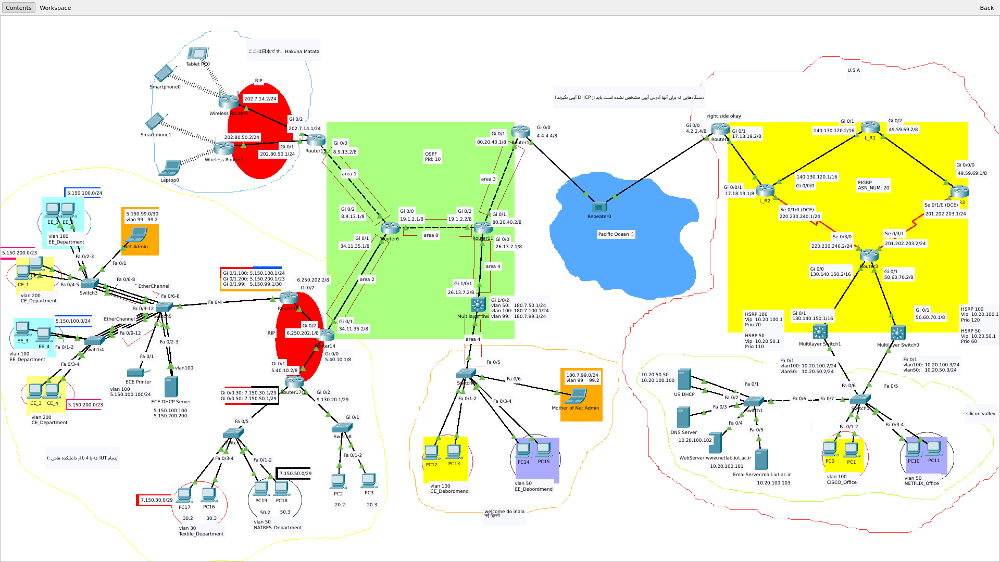

# 🌐 Awesome Network Lab Project

Welcome to my networking wonderland! This project was created using Cisco Packet Tracer to demonstrate networking concepts and configurations.

## 🚀 Project Overview

This network simulation project showcases various networking concepts and implementations using Cisco Packet Tracer.

## 📸 Project Screenshots

### Network Topology

## 🔧 Components Used

- Cisco Routers
- Layer 3 Switches
- End Devices
- Various Network Cables
- Network Servers:
  - DHCP Server
  - Web Server
  - DNS Server
  - EMAIL Server

## 🎯 Features

- [x] VLAN Configuration
- [x] Inter-VLAN Routing
- [x] DHCP Implementation
- [x] Static Routing
- [x] RIP Routing
- [x] OSPF Routing
- [x] EIGRP Routing
- [x] HSRP Configuration

## 🎓 Learning Outcomes

- Understanding of network topology design and implementation
- VLAN configuration, trunking, and management
- Dynamic and static routing protocol implementation
- Network security best practices and ACL configuration
- Server deployment and configuration (DHCP, DNS, Web, Email)
- High availability and redundancy setup using HSRP
- Network troubleshooting and monitoring skills
- Documentation and network diagram creation
- Understanding of TCP/IP and OSI models in practice

## 🤝 Contributing

Feel free to fork this project and add your own awesome networking solutions!

## ✨ Author

- Danial Mobini

## 📝 License

This project is open source and available under the [MIT License](LICENSE).
